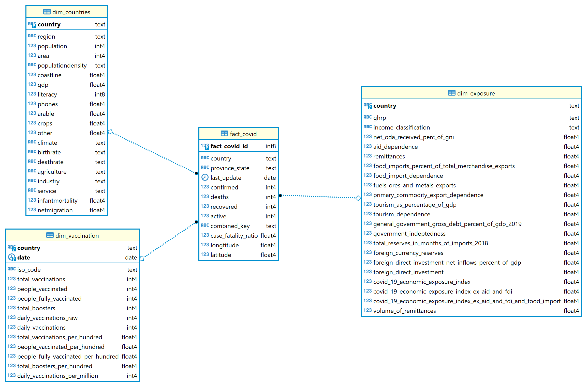
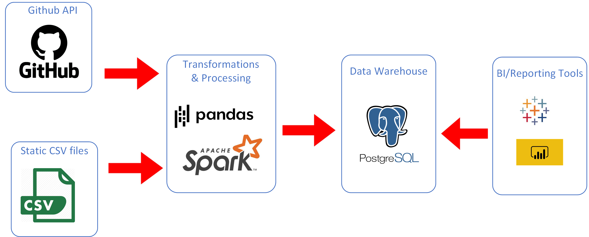

# Capstone project about COVID

- [Capstone project about COVID](#capstone-project-about-covid)
  - [Scope](#scope)
  - [Datasets](#datasets)
    - [JHU CSSE COVID-19 Dataset](#jhu-csse-covid-19-dataset)
      - [Covid-19 Economic Exposure Index](#covid-19-economic-exposure-index)
      - [Countries of the World](#countries-of-the-world)
      - [Coronavirus (COVID-19) Vaccinations](#coronavirus-covid-19-vaccinations)
  - [Data transformation](#data-transformation)
  - [Data Model](#data-model)
  - [Data Pipeline](#data-pipeline)
  - [How To](#how-to)
  - [Tools](#tools)
  - [Other Scenarios](#other-scenarios)
  - [SQL queries](#sql-queries)

## Scope

Johns Hopkins University (JHU) is a reference for COVID19 data.
The goal of this project is to provide a Datawarehouse containing information coming from JHU and aggregate with other sources, vaccination, economic exposure and countries.
This datawarehouse can be used to do analytics about COVID: number of positive cases per country/region, evolution of the cases, economic exposure of contries... (see examples queries in section [SQL queries](#sql-queries))

## Datasets

Data is composed of 4 datasets.

### [JHU CSSE COVID-19 Dataset](https://github.com/CSSEGISandData/COVID-19/tree/master/csse_covid_19_data)

This is the data repository for the 2019 Novel Coronavirus Visual Dashboard operated by the Johns Hopkins University Center for Systems Science and Engineering (JHU CSSE). Also, Supported by ESRI Living Atlas Team and the Johns Hopkins University Applied Physics Lab (JHU APL).

This folder contains daily case reports. All timestamps are in UTC (GMT+0).

Number of lines: 2 214 879

#### [Covid-19 Economic Exposure Index](https://data.humdata.org/dataset/covid-19-economic-exposure-index)

Country's economic exposure due to COVID-19. Composite indicator based on World Bank's datasets on remittances, food import dependence, primary commodity export dependence, tourism dependence, government indebtedness and foreign currency reserves.

Number of lines: 191

#### [Countries of the World](https://www.kaggle.com/fernandol/countries-of-the-world)

Information on population, region, area size, infant mortality and more.

Number of lines: 227

#### [Coronavirus (COVID-19) Vaccinations](https://ourworldindata.org/covid-vaccinations)

This vaccination dataset uses the most recent official numbers from governments and health ministries worldwide. Population estimates for per-capita metrics are based on the United Nations World Population Prospects. Income groups are based on the World Bank classification. A full list of our country-specific sources is available at the bottom of this page, and we also answer frequently-asked questions there.

In this dataset you can see all of the data on COVID-19 vaccinations (doses administered, people with at least 1 dose, and people fully vaccinated).

Number of lines: 54 341

## Data transformation

Covid19 dataset

- Remove FIPS and Admin2 of JHU CSSE COVID-19 Dataset as it is US only information
- Convert date values to date
- Convert Last_Update to datetime
- Rename Long_ field to Longitude and Lat to Latitude
- Convert Confirmed, Deaths, Recovered and Active to integer
- Convert Longitude, Latitude, Incident_Rate and Case_Fatality_Ratio to float
- Remove unnecessary fields

Countries dataset

- Rename columns with spaces
- Convert fields to integer or numeric depending of their type
- Remove unnecessary fields

Exposure dataset

- Replace spaces by _ in column names
- Replace , by . for numbers in Spark dataframe
- Replace "x", "No data" and "0" by NULL
- Convert fields to integer or float depending of their type
- Remove unnecessary fields

Vaccination

- Rename location column to country
- Convert fields to integer or numeric depending of their type

## Data Model

Since the purpose of this datawarehouse is for OLAP and BI app usage, we will model these data sets with star schema data modeling.

See ERD below:


## Data Pipeline



covid_api_sraping.ipynb

- Retrieve the COVID19 data from GitHub API and save them in directory "data\csse_covid_19_data\csse_covid_19_daily_reports\"

covid_processing.ipynb

- Read CSV files
- Transform data with Pandas and Spark
- Write the data in PostGresSQL

data_quality.ipynb

- check data quality: more than 0 rows and depending on the tables, check if the size is greater than a size limit

## How To

- create a project folder
- unzip files/directories in the project folder
- run `covid_api_scraping.ipynb` (optional, you already have 100 csv files in the zip file)
- run `covid_processing.ipynb`
- run `covid_data_quality.ipynb`

## Tools

**Requests**: this is a very basic library for web scraping. This tool does not parse the HTML data retrieved but in my case it was not necessary as the raw data is in CSV format

**Pandas**: for data transoformation pandas is very efficient and offers a good data representation

**Apache Sark**: Spark is very efficient to process huge amount of data in parallel and provides by default a set of tools for SQL

**PostGres**: for this project a relational database seems to be the good choice for analytics purpose

## Other Scenarios

The data was increased by 100x: I would use AWS EMR for the processing part and Redshift for datawarehousing.
These 2 AWS services offer performance and scability.

The pipelines would be run on a daily basis by 7 am every day: Apache Airflow could be used for building up a ETL data pipeline to regularly update the date.

The database needed to be accessed by 100+ people: I would use Redshift as it can accept up to 500 concurrent connections.

## SQL queries

Here are 3 SQL queries using the data model.
You can find result of below queries in the results folder.

Q1: number of positive cases per country

``` sql
SELECT country , max(confirmed) as total_confirmed
FROM public.fact_covid
GROUP BY country
ORDER BY total_confirmed DESC 
```

Q2: number of positive cases per region

``` sql
WITH t1 AS (SELECT country , MAX(confirmed) AS total_confirmed
FROM public.fact_covid
GROUP BY country
ORDER BY total_confirmed DESC)
SELECT dc.region, COUNT(t1.country), SUM(total_confirmed) 
FROM t1
JOIN dim_countries dc ON t1.country = dc.country
GROUP BY dc.region
```

Q3: total confirmed per income classification

``` sql
WITH t1 AS (SELECT country , MAX(confirmed) AS total_confirmed
FROM public.fact_covid
GROUP BY country
ORDER BY total_confirmed DESC)
SELECT COUNT(t1.country) AS total_countries, SUM(t1.total_confirmed) AS total_confirmed, de.income_classification
FROM t1
JOIN dim_exposure AS de ON t1.country = de.country
JOIN dim_countries AS dc ON t1.country = dc.country
GROUP BY de.income_classification
ORDER BY total_countries DESC
```
