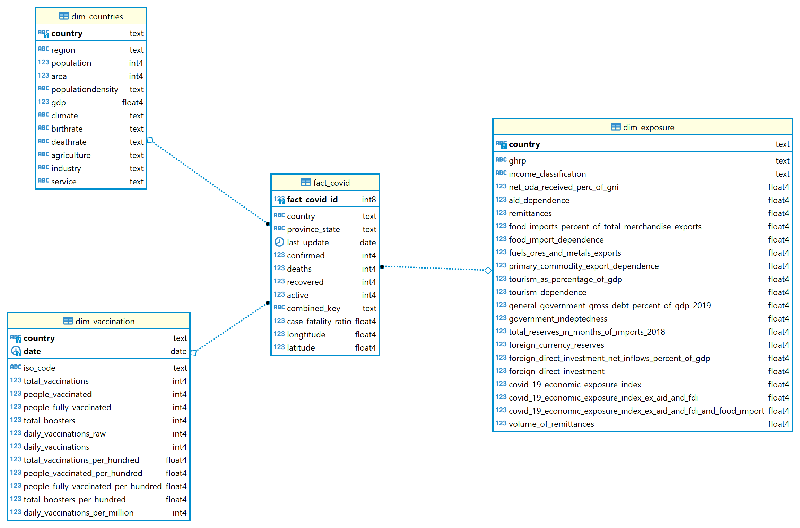

# Capstone project about COVID

## Step 1: Scope the Project and Gather Data

### Scope

The project goal is to provide a datalake containing information about COVID19.
API scraping is used to gather fact data and CSV files are used for dimension data

### Datas

Data is composed of 4 datasets.

#### [JHU CSSE COVID-19 Dataset](https://github.com/CSSEGISandData/COVID-19/tree/master/csse_covid_19_data)

This folder contains daily case reports. All timestamps are in UTC (GMT+0).

##### Field description

* Province_State: Province, state or dependency name.
* Country_Region: Country, region or sovereignty name. The names of locations included on the Website correspond with the official designations used by the U.S. Department of State.
* Last Update: MM/DD/YYYY HH:mm:ss  (24 hour format, in UTC).
* Lat and Long_: Dot locations on the dashboard. All points (except for Australia) shown on the map are based on geographic centroids, and are not representative of a specific address, building or any location at a spatial scale finer than a province/state. Australian dots are located at the centroid of the largest city in each state.
* Confirmed: Counts include confirmed and probable (where reported).
* Deaths: Counts include confirmed and probable (where reported).
* Recovered: Recovered cases are estimates based on local media reports, and state and local reporting when available, and therefore may be substantially lower than the true number. US state-level recovered cases are from [COVID Tracking Project](https://covidtracking.com/). We stopped to maintain the recovered cases (see [Issue #3464](https://github.com/CSSEGISandData/COVID-19/issues/3464) and [Issue #4465](https://github.com/CSSEGISandData/COVID-19/issues/4465)).
* Active: Active cases = total cases - total recovered - total deaths. This value is for reference only after we stopped to report the recovered cases (see [Issue #4465](https://github.com/CSSEGISandData/COVID-19/issues/4465))
* Incident_Rate: Incidence Rate = cases per 100,000 persons.
* Case_Fatality_Ratio (%): Case-Fatality Ratio (%) = Number recorded deaths / Number cases.
* All cases, deaths, and recoveries reported are based on the date of initial report. Exceptions to this are noted in the "Data Modification" and "Retrospective reporting of (probable) cases and deaths" subsections below.  

##### [Covid-19 Economic Exposure Index](https://data.humdata.org/dataset/covid-19-economic-exposure-index)

Country's economic exposure due to COVID-19. Composite indicator based on World Bank's datasets on remittances, food import dependence, primary commodity export dependence, tourism dependence, government indebtedness and foreign currency reserves.

##### [Countries of the World](https://www.kaggle.com/fernandol/countries-of-the-world)

Information on population, region, area size, infant mortality and more.

##### [Coronavirus (COVID-19) Vaccinations](https://ourworldindata.org/covid-vaccinations)

This vaccination dataset uses the most recent official numbers from governments and health ministries worldwide. Population estimates for per-capita metrics are based on the United Nations World Population Prospects. Income groups are based on the World Bank classification. A full list of our country-specific sources is available at the bottom of this page, and we also answer frequently-asked questions there.

In this dataset you can see all of our data on COVID-19 vaccinations (doses administered, people with at least 1 dose, and people fully vaccinated).

* location: name of the country (or region within a country).
* iso_code: ISO 3166-1 alpha-3 – three-letter country codes.
* date: date of the observation.
* total_vaccinations: total number of doses administered. For vaccines that require multiple doses, each individual dose is counted. If a person receives one dose of the vaccine, this metric goes up by 1. If they receive a second dose, it goes up by 1 again. If they receive a third/booster dose, it goes up by 1 again.
* total_vaccinations_per_hundred: total_vaccinations per 100 people in the total population of the country.
* daily_vaccinations_raw: daily change in the total number of doses administered. It is only calculated for consecutive days. This is a raw measure provided for data checks and transparency, but we strongly recommend that any analysis on daily vaccination rates be conducted using daily_vaccinations instead.
* daily_vaccinations: new doses administered per day (7-day smoothed). For countries that don't report data on a daily basis, we assume that doses changed equally on a daily basis over any periods in which no data was reported. This produces a complete series of daily figures, which is then averaged over a rolling 7-day window. An example of how we perform this calculation can be found here.
* daily_vaccinations_per_million: daily_vaccinations per 1,000,000 people in the total population of the country.
* people_vaccinated: total number of people who received at least one vaccine dose. If a person receives the first dose of a 2-dose vaccine, this metric goes up by 1. If they receive the second dose, the metric stays the same.
* people_vaccinated_per_hundred: people_vaccinated per 100 people in the total population of the country.
* people_fully_vaccinated: total number of people who received all doses prescribed by the vaccination protocol. If a person receives the first dose of a 2-dose vaccine, this metric stays the same. If they receive the second dose, the metric goes up by 1.
* people_fully_vaccinated_per_hundred: people_fully_vaccinated per 100 people in the total population of the country.
* total_boosters: Total number of COVID-19 vaccination booster doses administered (doses administered beyond the number prescribed by the vaccination protocol)
* total_boosters_per_hundred: Total number of COVID-19 vaccination booster doses administered per 100 people in the total population.

## Step 2: Explore and Assess the Data

### Cleanup tasks

Covid19 dataset

* Remove FIPS and Admin2 of JHU CSSE COVID-19 Dataset as it is US only information
* Convert date values to date
* Convert Last_Update to datetime
* Rename Long_ field to Longitude and Lat to Latitude
* Convert Confirmed, Deaths, Recovered and Active to integer
* Convert Longitude, Latitude, Incident_Rate and Case_Fatality_Ratio to float

Countries dataset

* Rename columns with spaces
* Convert fields to integer or numeric depending of their type

Exposure dataset

* Replace spaces by _ in column names
* Replace , by . for numbers in Spark dataframe
* Replace "x", "No data" and "0" by NULL
* Convert fields to integer or float depending of their type

Vaccination

* Rename location column to country
* Convert fields to integer or numeric depending of their type

## Step 3: Define the Data Model

* Map out the conceptual data model and explain why you chose that model
* List the steps necessary to pipeline the data into the chosen data model

### Data model

Since the purpose of this data warehouse is for OLAP and BI app usage, we will model these data sets with star schema data modeling.

See ERD below:

### Data Pipeline

* Reads all the CSV/JSON from "data\csse_covid_19_data\csse_covid_19_daily_reports" to fill fact_covid table
* Read static CSV files:
  * countries.csv in dim_countries
  * exposure.csv in dim_exposure
  * vaccination on dim_vaccination
