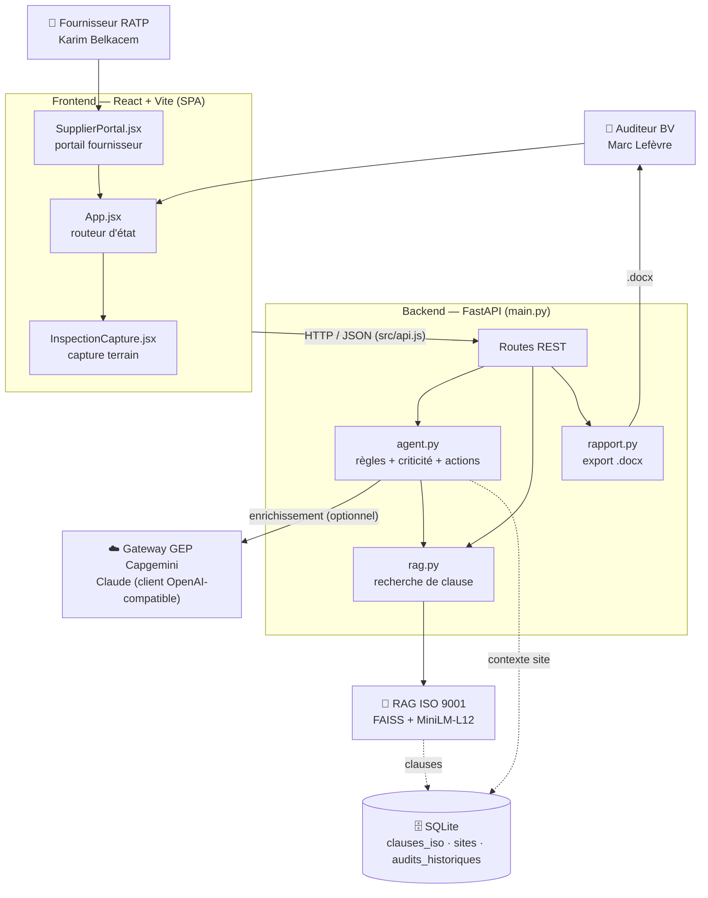
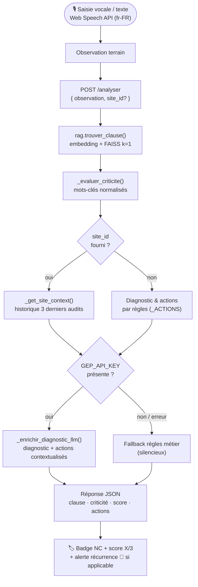
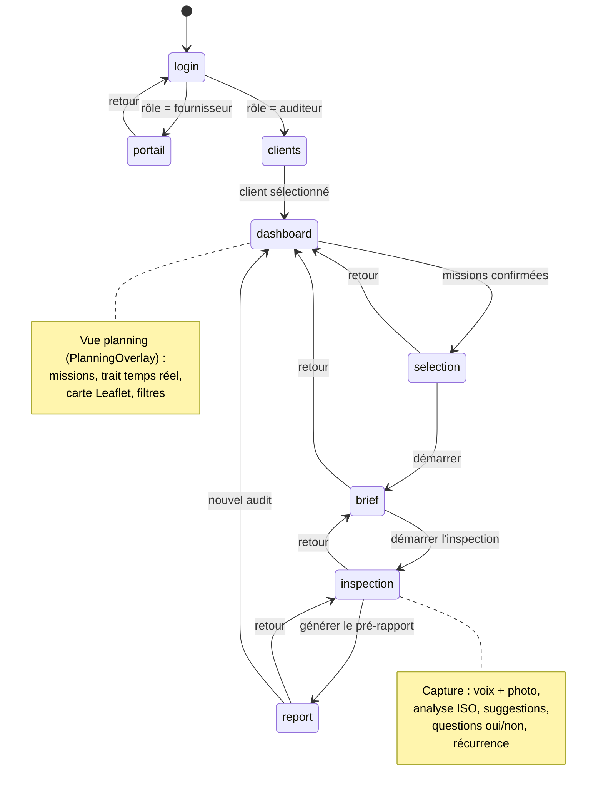

# Schémas d'architecture — UC 28 Inspection Augmentée

> Équipe Code Resonance · Hackathon Capgemini × Anthropic 2026
> Astuce : coller chaque bloc dans https://mermaid.live pour visualiser/exporter.

---

## Diagramme 1 — Architecture globale (C4 niveau 2 / conteneurs)

Montre les deux acteurs (auditeur BV et fournisseur RATP), la SPA React, le backend FastAPI et les services d'intelligence (gateway IA GEP + RAG ISO 9001 sur SQLite).

---

## Diagramme 2 — Séquence d'analyse d'une observation ISO

Flux complet depuis la saisie vocale jusqu'à l'affichage du badge de non-conformité, avec le repli sur les règles métier si l'IA est indisponible.

---

## Diagramme 3 — Navigation frontend (machine à états)

États pilotés par `view` dans App.jsx. La transition initiale dépend du rôle choisi au login (auditeur vs fournisseur).

